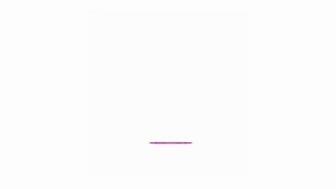

# Shraby Way

A 2.5D game with elements of survival and RPG, made in a nice animated style.

## Gameplay
An ordinary shrub named Shraby finds himself caught up in adventures in other worlds in search of a way home. In the process, he will be forced to fight various opponents, collect items, evolve, meet characters and learn the reasons for everything that is going on.

All of the environments in the game, (e.g. bushes and trees, etc.) are interactive. For example, when interacting with a pine tree with some chance you can get cones, which can later be used as a throwing weapon. Interacting with some elements of the environment can lead to both good and bad results for the player.

Opponents in the game are different objects that can be found in the forest. Some are ranged, some can only fight in close combat, and some have their own unique mechanics, to defeat which you must come up with a unique strategy. Battles in the game take place in real time. It is assumed that it is possible to escape from almost any opponent without fighting, if the player is not yet ready.

In the process, the player earns experience and levels. Each new level can be "invested" in one of the 4 elements. Different elements change different character parameters. (For example, investing in the earth element increases defense.)

## World map
The world map is a forest, infinitely looped to each side. Different background tiles may have different interactions. For example, the player falls through the water and walks slower in it.

## Development
#It's also possible to add more, in case the main gameplay is completed before the anticipated deadline.

## Download
The download of the beta will be available as soon as the main functionality is implemented
